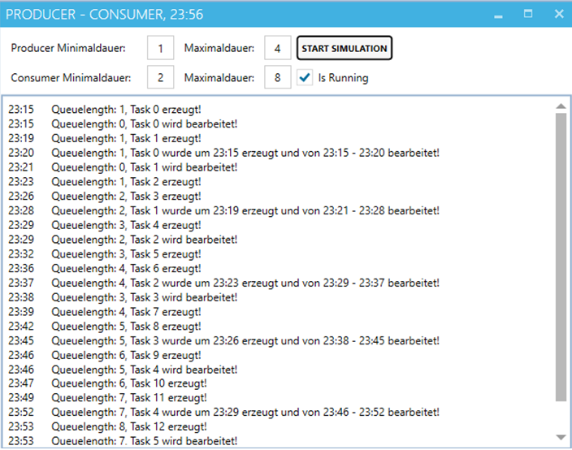
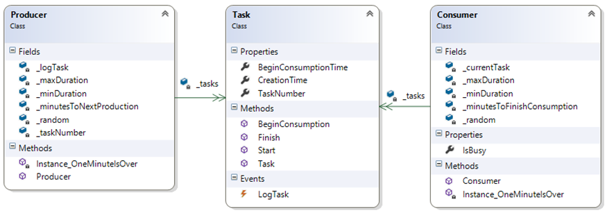

# Producer-Consumer mit Events

# Lernziele

* Events

# Beschreibung

## Allgemein

Die `FastClock` gibt wieder einmal den Takt vor. Sie ist in der Projektvorlage bereits fertig implementiert und auch initialisiert.

Ziel der Übung ist die Simulation eines Producer/Consumer-Szenarios. Ein `Producer` erzeugt innerhalb einer zufälligen Zeit (Minuten zwischen Minimal- und Maximaldauer) Tasks und stellt sie in eine `Queue`. Ein `Consumer` verarbeitet die Tasks dieser `Queue`. Die Verarbeitungszeit ist  von zufälliger Dauer.

Als `Queue` können Sie die .NET-Klasse `Queue<Task>` mit den Methoden `Enqueue(task)` und `Dequeue()` verwenden. Sie können aber auch eine normale `List<Task>` mit `Add()` und `RemoveAt()` einsetzen.

Der Task bietet folgende Methoden:

1. `Start`
   * Task wird erzeugt und in Queue gestellt
1. `BeginConsumption` 
   * Consumer holt Task aus der Queue und beginnt mit der Verarbeitung
1. `Finish` 
   * Task wurde verarbeitet
   
Der Task verständigt bei Aufruf jeder der drei Methoden das Hauptfenster und übermittelt eine Protokollnachricht (siehe Musterausdruck).

Ihre Realisierung kann natürlich vom Muster abweichen. Die privaten Felder und Methoden geben nur einen Hinweis auf die Musterlösung.
Zur optimalen Entkopplung der Elemente werden `Events` eingesetzt, die alle die gleichen Argumente (Sender ist der Task, Argument ist der Text) verwenden.
